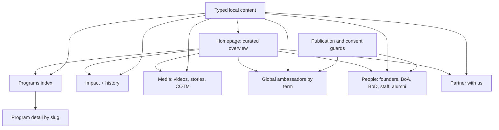

# Impactional Content Platform Roadmap

## I. Executive Summary

**Goal:** Evolve the current light-only “Generations in Motion” landing page into a curated, multi-page Impactional platform that clearly presents programs, verified impact, media, ambassadors, people, and partnership pathways without overloading the homepage.

**Success metrics:**

- Every primary content family has a first-party route (`/programs`, `/programs/[slug]`, `/impact`, `/media`, `/ambassadors`, `/people`, and `/partner`) and no program card sends visitors to the legacy Wix site.
- At 360 px, tablet, laptop, and 1440 px widths, all content is reachable without horizontal overflow; Programs card 01 is immediately accessible without sideways dragging.
- `npm run lint`, `npm run typecheck`, `npm test`, and the scoped Playwright suite pass; Chrome visual review confirms light-only visual continuity, readable spacing, keyboard access, and no broken motion states.

## II. Skill Matrix

| Component | Required skill | Implementation role |
|---|---|---|
| Roadmap and dependency design | `planner` | Defines staged implementation, explicit dependencies, and acceptance gates. |
| Final visual audit | `chrome:control-chrome` | Audits the running `npm run dev` site in the user-requested Chrome surface at representative viewports. |
| Product UI implementation | Project conventions and existing design system | Extends the existing Next.js/Tailwind components and tokens; `frontend-design` is explicitly excluded by user instruction. |
| PDF-derived impact content | Existing inspected report evidence | Uses the verified 2025–26 report facts already extracted for typed content and labels sourced claims by reporting period. |

No project-local `.agent/skills` directory exists. No additional specialized skill is required for this implementation.

## III. Logic & Architecture

The homepage remains an editorial overview rather than becoming a directory of every record. It previews each content family and hands off to dedicated server-rendered routes. Small client islands own filters, drawers, media playback, and motion. Placeholder personnel and ambassador records remain in the codebase but cannot render publicly until `isPublished: true`; this prevents invented or unapproved profiles from appearing as real people.

Content boundaries:

- `src/content/programs.ts`: program summaries, detail blocks, outcomes, eligibility, and first-party slugs.
- `src/content/impact.ts`: report metadata, current 2025–26 metrics, demographics, accolades, and history milestones.
- `src/content/media.ts`: curated YouTube entries, stories, and Changemaker of the Month records. Initial company-profile placeholder uses Rick Astley’s “Never Gonna Give You Up” YouTube ID and must be visibly labeled as placeholder/internal content until replaced.
- `src/content/people.ts`: founders, advisors, current board, staff, member recognition, and alumni with consent/publication flags.
- `src/content/ambassadors.ts`: ambassador terms, profiles, SDG focus, and final projects with publication flags.
- `src/content/site.ts`: navigation, shared calls to action, contact links, and social links.

Motion ownership remains unchanged: Lenis only interpolates desktop scroll; GSAP owns scroll-linked sequences; Motion owns React interaction state; CSS owns simple transitions. Every new route must remain fully readable in `?motion=off` and under `prefers-reduced-motion`.

## IV. Phased Roadmap

## Stage 1: Stabilize Programs and Content Contracts
> **Entry Condition:** The current homepage runs through `npm run dev`, and existing landing content/tests are present.
> **Exit Condition:** Program navigation is first-party, PEGI naming is correct, mobile Programs requires no horizontal drag, and shared content contracts reject unsafe or unpublished data.

### Module 1.1: Typed content foundation

- [ ] [P1.1.1] Split shared content models: Create typed modules for site navigation, programs, impact, media, ambassadors, and people while preserving the current homepage output during migration.
      depends_on: none
      Verify: `npm run typecheck` reports zero errors and no homepage import resolves to a missing export.

- [ ] [P1.1.2] Add publication and provenance fields: Define `isPublished`, consent/source metadata, reporting period, optional placeholder state, and safe external-link contracts where relevant.
      depends_on: P1.1.1
      Verify: Unit fixtures fail validation when a public person lacks consent/source metadata or when an external URL is not HTTPS.

- [ ] [P1.1.3] Seed placeholder-safe records: Add clearly marked, unpublished schemas for people, ambassadors, COTM, accolades, and demographics so empty states can be designed without fabricating public claims.
      depends_on: P1.1.2
      Verify: Unit test asserts no placeholder person or ambassador is returned by public selectors.

### Module 1.2: Programs usability repair

- [ ] [P1.2.1] Rename PEGI: Change the public title to “Peace, Education, & Global Innovation (PEGI)” and update its short label consistently.
      depends_on: P1.1.1
      Verify: `rg "Peace, Education" src tests` finds only the approved public name or an intentional short label.

- [ ] [P1.2.2] Introduce first-party program slugs: Map all four cards to `/programs/[slug]` and remove legacy Wix destinations from homepage program interactions.
      depends_on: P1.2.1
      Verify: Unit test asserts four unique slugs and four local `/programs/` hrefs.

- [ ] [P1.2.3] Replace small-screen horizontal dependence: Render Programs as a single-column/card stack on phones and a readable grid on tablets; reserve any pinned/horizontal choreography for capable desktop viewports only.
      depends_on: P1.2.2
      Verify: At 360×800 with `?motion=off`, program 01 is visible before program 02, all four links are keyboard reachable, and document overflow is at most 1 px.

- [ ] [P1.2.4] Harden desktop program motion: Ensure GSAP initializes only on fine-pointer desktop, tears down on breakpoint changes, and restores natural document flow when motion is off.
      depends_on: P1.2.3
      Verify: Repeatedly resize across the desktop breakpoint and confirm there is one program ScrollTrigger, no stuck pin spacer, and no runtime error.

### 🧪 Stage 1 Test Procedures

#### Test 1.1: Public content selectors and failure guards
- **Type:** Unit
- **Preconditions:** Typed content modules and selectors are implemented.
- **Steps:**
  1. Run `npm test -- tests/unit/content.test.ts`.
  2. Inspect the assertions for unique program slugs, HTTPS external links, and unpublished placeholder exclusion.
  3. Temporarily exercise the test fixture with `isPublished: true` and missing consent metadata inside the test only.
- **Expected Result:** Valid records pass; the invalid public-person fixture is rejected; placeholders are absent from public output.
- **Pass Command:** `npm test -- tests/unit/content.test.ts`
- **Fail Indicators:** Duplicate slugs, legacy Wix program URLs, non-HTTPS URLs, or placeholder profiles returned publicly.

#### Test 1.2: Programs responsive access
- **Type:** E2E
- **Preconditions:** `npm run dev` serves `http://127.0.0.1:3000`.
- **Steps:**
  1. Open `/?motion=off` at 360×800.
  2. Scroll vertically to Programs without any horizontal gesture.
  3. Tab through all four program links and activate program 01.
  4. Repeat at 1440×900 with motion enabled, then resize to 390×844.
- **Expected Result:** Card 01 is never hidden behind the rail; all four cards remain reachable; activation opens a local detail route; resizing leaves no spacer or horizontal overflow.
- **Pass Command:** `npm run test:e2e -- --project=mobile --grep "program"`
- **Fail Indicators:** A sideways gesture is required, card 01 cannot be focused, URL leaves the site, duplicate ScrollTriggers appear, or layout width exceeds the viewport.

## Stage 2: Route Shell and Navigation Architecture
> **Entry Condition:** Stage 1 content contracts and first-party program links are complete.
> **Exit Condition:** All approved top-level routes exist with consistent light-only navigation, metadata, containers, and meaningful empty states.

### Module 2.1: Shared route shell

- [ ] [P2.1.1] Centralize route navigation: Replace homepage-only hash navigation with a typed global navigation model while retaining valid homepage section anchors where useful.
      depends_on: P1.1.3, P1.2.2
      Verify: Header and mobile drawer expose Programs, Impact, Media/Stories, Ambassadors, People, and Partner destinations with no dead href.

- [ ] [P2.1.2] Build reusable interior-page primitives: Add page intro, breadcrumb, editorial section, filtered collection shell, empty state, and route CTA components using existing tokens.
      depends_on: P2.1.1
      Verify: Component examples render on `/design-system` in default, focus, empty, and reduced-motion states.

- [ ] [P2.1.3] Enforce light-only surfaces: Extend semantic tokens and component recipes only with white, warm-white, pale pink, pale blue, and pale mint surfaces; remove any route-level dark-theme hooks.
      depends_on: P2.1.2
      Verify: Token test rejects `prefers-color-scheme: dark`, `.dark`, `data-theme="dark"`, and near-black section backgrounds outside text/icon tokens.

### Module 2.2: Route scaffolds and metadata

- [ ] [P2.2.1] Scaffold content routes: Create server-rendered pages for `/programs`, `/impact`, `/media`, `/ambassadors`, `/people`, and `/partner` with unique H1s and non-placeholder metadata descriptions.
      depends_on: P2.1.3
      Verify: Each path responds 200 and has exactly one visible H1 with a unique title and description meta tag.

- [ ] [P2.2.2] Add not-found and empty states: Provide a branded not-found path plus approved-data pending states for people and ambassador collections.
      depends_on: P2.2.1
      Verify: Unknown routes show a useful return action; empty collections explain that profiles are awaiting publication without exposing draft names.

- [ ] [P2.2.3] Update Playwright dev command: Change automated server startup to `npm run dev` and keep production build outside this roadmap’s verification flow per user instruction.
      depends_on: P2.2.1
      Verify: `npm run test:e2e -- --grep "route shell"` starts or reuses the dev server without invoking `next build` or pnpm.

### 🧪 Stage 2 Test Procedures

#### Test 2.1: Route and navigation matrix
- **Type:** E2E
- **Preconditions:** `npm run dev` is running and all route scaffolds exist.
- **Steps:**
  1. Visit `/`, `/programs`, `/impact`, `/media`, `/ambassadors`, `/people`, and `/partner`.
  2. On each route, assert a unique H1, title, description, header, footer, and skip link.
  3. At mobile width, open the drawer, select a route, then use Escape on a second opening.
- **Expected Result:** All routes return 200; navigation closes after routing; Escape restores focus; no content is clipped.
- **Pass Command:** `npm run test:e2e -- --grep "route shell|navigation"`
- **Fail Indicators:** 404/500 response, repeated metadata, missing H1, drawer focus loss, or a link targeting a nonexistent anchor.

#### Test 2.2: Light-only and unknown-route edge cases
- **Type:** Integration
- **Preconditions:** Token guard and not-found UI are implemented.
- **Steps:**
  1. Run `npm test -- tests/unit/tokens.test.ts`.
  2. Visit `/this-route-does-not-exist`.
  3. Emulate dark OS preference and reload `/impact`.
- **Expected Result:** Token guard passes; branded 404 appears; dark OS preference does not change the site into a dark theme.
- **Pass Command:** `npm test -- tests/unit/tokens.test.ts`
- **Fail Indicators:** Dark-mode selector found, dark section appears, raw Next.js error page, or missing recovery link.

## Stage 3: Program Index and Detail Pages
> **Entry Condition:** Stage 2 route shell and first-party program slugs are available.
> **Exit Condition:** Every homepage program card reaches a complete, accessible detail page and the Programs index supports effortless discovery at all widths.

### Module 3.1: Program presentation

- [ ] [P3.1.1] Build the Programs index: Present four programs in a responsive editorial grid with summaries, audience cues, and clear detail links.
      depends_on: P2.2.1
      Verify: `/programs` renders exactly four published program cards and no horizontal scroll at 360 px.

- [ ] [P3.1.2] Build program detail template: Add `generateStaticParams`, route metadata, overview, outcomes, participation details, related media, and opportunity CTA for each slug.
      depends_on: P3.1.1
      Verify: All four known slugs render unique H1/content; an unknown slug returns not-found.

- [ ] [P3.1.3] Add honest incomplete-content treatment: Omit unavailable sections or label them “details coming soon” rather than inventing dates, eligibility, or application status.
      depends_on: P3.1.2
      Verify: A fixture with missing outcomes renders no empty heading and no fabricated value.

### Module 3.2: Programs motion and interaction

- [ ] [P3.2.1] Add restrained card feedback: Use Motion for hover/tap depth only on capable pointers, CSS for focus/underline, and static final layouts under reduced motion.
      depends_on: P3.1.1
      Verify: Keyboard focus does not trigger pointer tilt; touch activation requires one tap; reduced motion removes transform travel.

- [ ] [P3.2.2] Cross-link discovery paths: Connect homepage, index, detail, media, and final opportunity CTA without opening internal content in a new tab.
      depends_on: P3.1.2
      Verify: Link test asserts internal program URLs lack `target="_blank"`; only true external destinations use safe rel attributes.

### 🧪 Stage 3 Test Procedures

#### Test 3.1: Program index and detail happy path
- **Type:** E2E
- **Preconditions:** Four program records and detail routes are implemented.
- **Steps:**
  1. Visit `/?motion=off`, activate each homepage program link in turn, and record the destination.
  2. Visit `/programs` and open each card with keyboard Enter.
  3. Assert the detail H1 matches the chosen card, including the full PEGI title.
- **Expected Result:** All paths stay first-party and map to the correct unique content; back navigation returns to the prior scroll context.
- **Pass Command:** `npm run test:e2e -- --grep "program detail"`
- **Fail Indicators:** Wix redirect, mismatched program content, missing PEGI suffix, new-tab internal navigation, or lost keyboard focus.

#### Test 3.2: Unknown and incomplete program edge cases
- **Type:** Integration
- **Preconditions:** Detail template and incomplete-content guards exist.
- **Steps:**
  1. Request `/programs/not-a-program`.
  2. Render the incomplete program fixture in its component test.
- **Expected Result:** Unknown slug produces 404; incomplete data produces a coherent page without undefined text or empty landmark sections.
- **Pass Command:** `npm test -- --runInBand`
- **Fail Indicators:** 500 response, literal `undefined`, empty headings, or invented schedule/application details.

## Stage 4: Impact and History
> **Entry Condition:** Stage 2 route shell and validated report-period content contract are complete.
> **Exit Condition:** The platform consistently uses 2025–26 metrics, distinguishes history from detailed impact, and presents sourced achievements and demographics without duplicate claims.

### Module 4.1: Current impact data

- [ ] [P4.1.1] Replace legacy homepage metrics: Use 2025–26 report values—53K+ audience enlightened, approximately $3,300 donations/grants, 32K+ followers, 10+ programs, 2,000+ changemakers across 50+ countries, and 3M+ social reach—with explicit reporting-period context.
      depends_on: P1.1.2
      Verify: `rg "8.5k|600k|six programs|6 international" src tests` returns no obsolete public metric copy.

- [ ] [P4.1.2] Build “The Impact Created”: Add report overview, program-specific outcome groups, demographics, achievements/accolades, and source/provenance labels on `/impact`.
      depends_on: P4.1.1, P2.2.1
      Verify: Every quantitative card exposes a reporting period and source label; missing demographics use an approved-data empty state.

- [ ] [P4.1.3] Add map/globe atmosphere: Introduce a low-contrast, decorative map/globe SVG overlay on pale blue sections without reducing text contrast or becoming a dark section.
      depends_on: P4.1.2
      Verify: Automated contrast scan reports no critical violations; overlay is `aria-hidden` and does not intercept input.

### Module 4.2: History and narrative motion

- [ ] [P4.2.1] Build History timeline: Present concise milestones from the February 2021 founding onward, while linking detailed achievements to “The Impact Created.”
      depends_on: P4.1.2
      Verify: Timeline entries sort chronologically and duplicate no full accolade descriptions from the impact collection.

- [ ] [P4.2.2] Preserve the SVG line language: Extend the existing route/path motif through history and impact sections with one GSAP owner per animated SVG.
      depends_on: P4.2.1
      Verify: With motion enabled, each path has one ScrollTrigger; with `?motion=off`, final SVG and all copy are visible without pinning.

- [ ] [P4.2.3] Preserve readable locked manifesto: Keep desktop and mobile pinning long enough for the blur-to-focus statement to be read, then release naturally before the next section.
      depends_on: P4.2.2
      Verify: At 390×844 and 1440×900, the camera stays locked during word focus, releases after completion, and never overlays the next section.

### 🧪 Stage 4 Test Procedures

#### Test 4.1: Metrics and source integrity
- **Type:** Unit
- **Preconditions:** Impact content has migrated to the 2025–26 report model.
- **Steps:**
  1. Run the impact/content unit tests.
  2. Assert the six approved aggregate values and the report period.
  3. Pass a metric fixture without `sourceLabel` to the validator.
- **Expected Result:** Approved values render server-side; the incomplete fixture is rejected from public output; old values are absent.
- **Pass Command:** `npm test -- tests/unit/content.test.ts`
- **Fail Indicators:** 2021–23 metric remains, a metric lacks its period/source, or placeholder demographic appears as fact.

#### Test 4.2: Impact visuals and motion edge cases
- **Type:** E2E
- **Preconditions:** Impact page, overlays, and GSAP sequences are implemented; dev server is running.
- **Steps:**
  1. Visit `/impact?motion=off` at 390×844 and 1440×900; assert final copy and paths are visible.
  2. Visit `/impact` with motion allowed; scroll slowly through manifesto and history.
  3. Resize across mobile/desktop breakpoints and revisit the section.
  4. Run axe and horizontal-overflow checks.
- **Expected Result:** No stuck pin, duplicate trigger, dark surface, unreadable overlay, critical axe issue, or viewport overflow occurs.
- **Pass Command:** `npm run test:e2e -- --grep "impact|manifesto"`
- **Fail Indicators:** Camera unlocks before copy is readable, path disappears in reduced motion, duplicated counter animation, or overlay reduces contrast.

## Stage 5: Media, YouTube, Stories, and Changemaker Recognition
> **Entry Condition:** Shared route primitives and typed media contracts are complete.
> **Exit Condition:** `/media` offers curated video, story, and COTM collections with performant playback, explicit placeholder labeling, and submission/application actions.

### Module 5.1: Video showcase

- [ ] [P5.1.1] Model curated YouTube entries: Store video ID, title, category, thumbnail/alt, publication date, placeholder status, and provenance locally; do not add live YouTube API credentials.
      depends_on: P1.1.2
      Verify: Unit test rejects malformed video IDs and requires visible placeholder labeling for placeholder entries.

- [ ] [P5.1.2] Build consent-based YouTube facade: Render a lightweight thumbnail and accessible play action that creates the iframe only after activation, with a direct YouTube fallback link.
      depends_on: P5.1.1, P2.1.2
      Verify: Initial HTML contains no YouTube iframe; activation inserts one iframe with a descriptive title; blocked embed still exposes the fallback link.

- [ ] [P5.1.3] Add company-profile placeholder: Seed Rick Astley’s “Never Gonna Give You Up” (`dQw4w9WgXcQ`) as the temporary company-profile slot, visibly marked “Placeholder — replace before launch.”
      depends_on: P5.1.2
      Verify: `/media` shows the placeholder warning adjacent to the facade and no copy describes the video as real Impactional footage.

### Module 5.2: Stories and COTM

- [ ] [P5.2.1] Build curated Stories in Motion: Present local editorial summaries with explicit source links to Instagram/site posts; do not scrape or live-sync Instagram.
      depends_on: P1.1.2, P2.2.1
      Verify: Story cards expose title, date, source platform, alt text, and safe external URL.

- [ ] [P5.2.2] Build chronological COTM archive: Order published Changemaker of the Month records from earliest to latest and provide an honest empty state until Marketing supplies approved records.
      depends_on: P1.1.3, P5.2.1
      Verify: Sorting test handles identical dates deterministically; unpublished fixtures never render.

- [ ] [P5.2.3] Add contribution actions: Add “Submit a story” and “Apply to be Changemaker of the Month” email/approved-link actions with prefilled context.
      depends_on: P5.2.2
      Verify: Links are keyboard accessible, have meaningful names, and encode subjects safely.

### 🧪 Stage 5 Test Procedures

#### Test 5.1: Video performance and fallback
- **Type:** E2E
- **Preconditions:** `/media` includes the facade and placeholder video.
- **Steps:**
  1. Load `/media?motion=off` and inspect iframe count before interaction.
  2. Activate the placeholder video with keyboard.
  3. Block `youtube.com/embed/*`, reload, and inspect the direct fallback.
- **Expected Result:** Zero initial iframe; one titled iframe after activation; placeholder label always visible; direct fallback remains usable when embedding fails.
- **Pass Command:** `npm run test:e2e -- --grep "video facade"`
- **Fail Indicators:** Eager iframe loading, unlabeled iframe, autoplay before consent, missing placeholder warning, or no fallback link.

#### Test 5.2: Curated story and COTM edge cases
- **Type:** Unit
- **Preconditions:** Media selectors and chronological sorting are implemented.
- **Steps:**
  1. Run media content tests with mixed published/unpublished records and equal dates.
  2. Validate story links with one non-HTTPS fixture.
- **Expected Result:** Only published records render, ordering is deterministic, and unsafe story URL is rejected.
- **Pass Command:** `npm test -- tests/unit/media.test.ts`
- **Fail Indicators:** Draft records leak, ordering changes between runs, unsafe link passes, or empty archive renders a blank section.

## Stage 6: Ambassadors and People
> **Entry Condition:** Publication/consent guards and route shells are complete.
> **Exit Condition:** Ambassador and team structures support approved future data while showing useful, honest placeholders now; no unapproved identity is published.

### Module 6.1: Global Ambassador Showcase

- [ ] [P6.1.1] Build term-aware ambassador model: Support term/year, profile and bio, country, SDG focus, final project, image/alt, social link, consent, provenance, and publication status.
      depends_on: P1.1.3
      Verify: Validator rejects a published ambassador missing term, SDG focus, project status, consent, or image alt.

- [ ] [P6.1.2] Build ambassador filters and cards: Add accessible term filters for 2024, 2025, and future terms with server-rendered default content and URL-search-param state.
      depends_on: P6.1.1, P2.2.1
      Verify: Filter is operable by keyboard, survives reload through the URL, and announces zero approved profiles without exposing drafts.

- [ ] [P6.1.3] Add final-project treatment: Render published project summaries and safe project links; represent “not yet supplied” independently from “no final project.”
      depends_on: P6.1.2
      Verify: Component test distinguishes pending data, intentionally absent project, and published project states.

### Module 6.2: Minds Behind Impactional

- [ ] [P6.2.1] Build categorized people model: Support founders/BoA, current BoD, staff, Member of the Month, and eligible alumni, including role, summary, quote where applicable, portrait/alt, social link, term, consent, provenance, and publication state.
      depends_on: P1.1.3
      Verify: Validator applies category-specific requirements and excludes drafts from every public selector.

- [ ] [P6.2.2] Build People page hierarchy: Present categories in stakeholder order—Founders/BoA, current BoD, staff, recognition, eligible past members—with clear current/past labels.
      depends_on: P6.2.1, P2.2.1
      Verify: Heading hierarchy has one H1 and ordered H2 category sections; empty categories use approved-data messages.

- [ ] [P6.2.3] Add behind-the-scenes editorial module: Create a staff-culture/story slot fed by approved local content rather than turning staff profiles into decorative filler.
      depends_on: P6.2.2, P5.2.1
      Verify: When no approved story exists, the module is omitted or shows a defined editorial placeholder without stock/fabricated staff imagery.

### 🧪 Stage 6 Test Procedures

#### Test 6.1: Ambassador filters and privacy guards
- **Type:** Integration
- **Preconditions:** Ambassador model, selector, and filters are implemented.
- **Steps:**
  1. Run fixtures containing one approved ambassador, one unpublished ambassador, and one invalid consent record.
  2. Visit `/ambassadors?term=2025`, then choose 2024 with keyboard and reload.
  3. Request an unknown term.
- **Expected Result:** Only approved record can render; URL state persists; unknown term shows a useful zero-result state and route recovery.
- **Pass Command:** `npm run test:e2e -- --grep "ambassador"`
- **Fail Indicators:** Draft identity appears, filter loses focus, reload resets a valid filter, or invalid term causes 500.

#### Test 6.2: People categories and incomplete data
- **Type:** Unit
- **Preconditions:** People category validators/selectors exist.
- **Steps:**
  1. Run people tests with valid BoA, BoD, staff, and alumni fixtures.
  2. Remove quote from BoA and term from current BoD fixtures.
  3. Mark an unconsented fixture published.
- **Expected Result:** Category requirements are enforced; unconsented record is excluded/rejected; UI never prints missing fields as blanks or `undefined`.
- **Pass Command:** `npm test -- tests/unit/people.test.ts`
- **Fail Indicators:** Invalid published identity passes, categories appear out of order, or unpublished records are discoverable in HTML.

## Stage 7: Partner Pathway and Homepage Curation
> **Entry Condition:** Programs, Impact, Media, Ambassadors, and People routes have stable preview-ready content/empty states.
> **Exit Condition:** The homepage provides concise previews rather than duplicating full directories, and `/partner` offers a clear email-based collaboration path.

### Module 7.1: Partner with Us

- [ ] [P7.1.1] Build dedicated partner page: Explain collaboration modes, relevant impact proof, expected information, and a direct email CTA; do not introduce a backend form.
      depends_on: P2.2.1, P4.1.2
      Verify: `/partner` has one primary mail action, one secondary opportunity/Linktree action, and no nonfunctional form controls.

- [ ] [P7.1.2] Add partner readiness states: Provide clear instructions if the mail client does not open, including a visible copyable email address.
      depends_on: P7.1.1
      Verify: With mail protocol handling unavailable, the contact address and subject guidance remain selectable and readable.

### Module 7.2: Curated homepage composition

- [ ] [P7.2.1] Recompose post-hero sequence: Keep the approved hero, locked blur-to-focus manifesto, and SVG line animation; follow with concise previews for Programs, Impact/History, Media, Ambassadors/People, and Partner.
      depends_on: P3.2.2, P4.2.3, P5.2.3, P6.2.3, P7.1.2
      Verify: Homepage contains no repeated hero collage, no full personnel directory, and every preview has a route handoff.

- [ ] [P7.2.2] Normalize content gutters and rhythm: Apply shared page containers so text and controls never sit flush against the viewport on mobile or ultra-wide screens.
      depends_on: P7.2.1
      Verify: At 360, 768, 1280, and 1440 px widths, content gutters meet the token minimum and no primary text touches the viewport edge.

- [ ] [P7.2.3] Maintain motion capability gates: Audit each homepage sequence for one animation owner, touch-native scrolling, `?motion=off`, and reduced-motion final-state readability.
      depends_on: P7.2.2
      Verify: Motion-off E2E run finds no pin spacers, transforms blocking reading, running marquees, or animated counters.

### 🧪 Stage 7 Test Procedures

#### Test 7.1: Partner conversion happy and fallback paths
- **Type:** Manual
- **Preconditions:** `/partner` is implemented and the dev server is running.
- **Steps:**
  1. Open `/partner` with keyboard navigation only.
  2. Activate the primary email CTA and inspect the recipient and encoded subject.
  3. Return and select the visible fallback email text.
- **Expected Result:** CTA targets the approved Impactional email with useful context; fallback remains usable without a configured mail client.
- **Fail Indicators:** Dead form, hidden contact address, incorrect recipient, or inaccessible CTA name.

#### Test 7.2: Homepage composition and layout edges
- **Type:** E2E
- **Preconditions:** All homepage previews are integrated.
- **Steps:**
  1. Visit `/?motion=off` at 360×800, 768×1024, 1280×800, and 1440×900.
  2. Verify section order, unique headings, minimum gutters, first-party preview links, and zero horizontal overflow.
  3. Visit `/` at 390×844 with touch enabled and confirm native vertical scrolling.
- **Expected Result:** The page reads as one light editorial journey, every preview hands off correctly, and touch users never need horizontal dragging.
- **Pass Command:** `npm run test:e2e -- --grep "homepage composition|responsive"`
- **Fail Indicators:** Dark/sudden section, edge-flush copy, repeated hero image, trapped scroll, missing route link, or viewport overflow.

## Stage 8: Documentation, Automated Gates, and Chrome Visual Acceptance
> **Entry Condition:** All product routes and homepage curation are implemented.
> **Exit Condition:** Documentation, automated checks, responsive screenshots, and user-requested Chrome audit are complete with no critical issue remaining.

### Module 8.1: Design-system and content documentation

- [ ] [P8.1.1] Update `/design-system`: Document new route primitives, cards, empty states, filters, video facade, motion recipes, responsive behavior, and light-only constraint; retain no-index metadata.
      depends_on: P7.2.3
      Verify: `/design-system` renders every new primitive and remains `noindex, nofollow`.

- [ ] [P8.1.2] Document editorial workflow: Add instructions for replacing Rick Astley, publishing people/ambassadors only after approval, adding COTM/story records, recording provenance/alt text, and updating report-period metrics.
      depends_on: P8.1.1
      Verify: Documentation names every required field and includes a pre-publication checklist with placeholder removal.

- [ ] [P8.1.3] Synchronize token/content tests: Expand tests so component usage, motion tokens, content schemas, and docs cannot silently drift.
      depends_on: P8.1.2
      Verify: Intentionally removing a documented token or required content field causes the relevant test to fail.

### Module 8.2: Automated and visual acceptance

- [ ] [P8.2.1] Expand Playwright viewport matrix: Cover 360 px, 390 px touch, tablet, laptop, and 1440 px desktop with `?motion=off` baselines plus scoped motion tests.
      depends_on: P7.2.3
      Verify: Config lists all required viewport projects and each captures deterministic key-route screenshots.

- [ ] [P8.2.2] Add accessibility and resilience coverage: Test critical axe violations, heading order, focus restoration, external-link safety, server-rendered metrics, unknown slugs/filters, image failure treatment, and no horizontal overflow.
      depends_on: P8.2.1, P8.1.3
      Verify: Scoped Playwright suite passes against `npm run dev` and produces no unexpected page errors.

- [ ] [P8.2.3] Audit motion lifecycle: Exercise scroll, resize, route navigation, touch, reduced motion, and `?motion=off` for duplicate ScrollTriggers, stuck Lenis state, hydration errors, and unreadable intermediate frames.
      depends_on: P8.2.2
      Verify: Instrumented E2E assertions report zero page errors and stable trigger counts after three breakpoint cycles.

- [ ] [P8.2.4] Perform Chrome visual audit: Use the user’s Chrome to review homepage and all primary routes at mobile and desktop dimensions while `npm run dev` is running, recording and fixing any visual issue found.
      depends_on: P8.2.3
      Verify: Chrome review confirms correct hero scale/pills, readable gutters, locked mobile/desktop manifesto, light-only continuity, accessible Programs, and coherent route handoffs.

### 🧪 Stage 8 Test Procedures

#### Test 8.1: Complete automated quality gate
- **Type:** Integration/E2E
- **Preconditions:** Implementation and documentation tasks are complete; dependencies are installed; no production build is required.
- **Steps:**
  1. Run `npm run lint`.
  2. Run `npm run typecheck`.
  3. Run `npm test`.
  4. Start `npm run dev` and run `npm run test:e2e`.
- **Expected Result:** Every command exits 0; no Next.js hydration/page error, critical axe violation, broken media assertion, or overflow assertion occurs.
- **Pass Command:** `npm run lint && npm run typecheck && npm test && npm run test:e2e`
- **Fail Indicators:** Any nonzero exit, console/page error, flaky viewport screenshot, or Playwright failure.

#### Test 8.2: Chrome visual and interaction acceptance
- **Type:** Manual
- **Preconditions:** `npm run dev` is serving the final implementation and Chrome control is connected.
- **Steps:**
  1. Inspect `/` at mobile and desktop sizes with motion on, then with `?motion=off`.
  2. Inspect `/programs` and each detail; verify program 01 access and PEGI naming.
  3. Inspect `/impact`, `/media`, `/ambassadors`, `/people`, `/partner`, and `/design-system`.
  4. Test keyboard focus, mobile drawer, video facade, term filters, link handoffs, and breakpoint resizing.
- **Expected Result:** Visual hierarchy is cohesive and light-only; no edge-flush content, oversized/undersized hero media, misplaced pills, dark section, clipped mask, stuck pin, or inaccessible control remains.
- **Fail Indicators:** Any observed mismatch with the expected result; visual acceptance remains open until corrected and rechecked.

## V. Final Verification Checklist

- [ ] The homepage is curated and does not duplicate full route content.
- [ ] Hero composition and mobile pills remain visually balanced; the next section does not repeat the hero collage.
- [ ] Blur-to-focus manifesto locks the viewport on desktop and mobile until readable, then releases cleanly.
- [ ] Programs card 01 is immediately reachable on mobile; no horizontal drag is required.
- [ ] All four program cards use internal detail routes and PEGI uses the approved full name.
- [ ] Impact values and report-period labels consistently use the 2025–26 report; obsolete 2021–23 homepage values are gone.
- [ ] Impact/history SVGs remain decorative, performant, readable under reduced motion, and light-only.
- [ ] Media uses curated local metadata and a lazy YouTube facade; Rick Astley is visibly marked as a replace-before-launch placeholder.
- [ ] Stories and COTM support chronological approved records plus submission/application actions.
- [ ] Ambassador and people pages never expose unpublished, unconsented, or fabricated identities.
- [ ] Partner page provides a working email path and visible fallback contact details without a backend form.
- [ ] All internal navigation stays in the same browser tab; external links are HTTPS and use safe rel attributes.
- [ ] All routes have unique metadata, semantic headings, skip links, focus visibility, and useful empty/not-found states.
- [ ] No dark mode selector, dark theme, or sudden dark section exists anywhere.
- [ ] No horizontal overflow occurs at 360, 390, tablet, laptop, or 1440 px widths.
- [ ] `?motion=off` and `prefers-reduced-motion` render final readable states without pins, counters, marquees, or pointer tracking.
- [ ] `npm run lint`, `npm run typecheck`, `npm test`, and `npm run test:e2e` pass against `npm run dev`; no production build is run.
- [ ] Final Chrome audit is completed on the actual running site and all identified visual defects are rechecked after correction.
